# Disease modeling
Disease models

This a simple program for disease spreading modeling. The original purpose of this program was to test different ODE systems which intended to model the spread of diseases using different computational solver methods. Some other features were added after. The program was written in python and it is presented in a form of a GUI, the project was developed using the PyQt4 GUI toolkit. The program was tested using **Python2** the implementation using python 3 wasn't tested.  

To start the program you just need to run **main.py**

The program by default has the options 
+ Forward Euler method
+ Runge Kutta 2nd order 
+ Runge Kutta 4th order

and the disease spreading models used were>

+ SIS Model *, **
+ SIR Model *  

Between the extra features added is the option of select your own solver method and ODE model so be solved, but it needs to be improved and still has some flaws. 

*[Shabbir et al, A note on Exact solution of SIR and SIS epidemic models](https://arxiv.org/pdf/1012.5035.pdf) 

**[Towers et al, Pandemic H1N1 influenza: predicting the course of a pandemic and assessing the efficacy of the planned vaccination programme in the United States ](https://www.eurosurveillance.org/content/10.2807/ese.14.41.19358-en)

## Theoretical Background

### The models

* The SIS Model

The SI model is the simplest way to model the behaviour of a disease. The model considers two kinds of populations *Susceptible* and *Infected* ones. Every susceptible will become infected eventually. The ODE system describing the system without
vital dynamics is given by

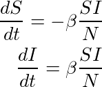

where N + S + I, the total population and β is infection rate. A similar approximation, which considers that recovered individuals can become infected again, is known as the Kermack-Mckendrick model and it is given by the equations

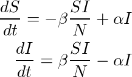

where α is the recover coefficient.

* The SIR Model

A similar model, but considering 3 kind of populations, Susceptible, Infected and Recovered ones (SIR) is particular useful in diseases when after suffering the infection and surviving, the individual develops lasting resistance. The set of equations that
define the model are

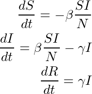

where β is the infection rate and γ is the recover coefficient. Here, the dynamics of the system depends on the ratio R_0 = βγ known as the basic reproduction number.

**Seasonal Forcing**

In the previous models the assumption that the transmission rate β or the reproduction number keep constant in time. The meaning of this constants relates to the number of contacts that a person has during a period of time, which could be true for a short period of time but not for long periods, like a year. An approximation to solve this issue is the assumption that β varies as 

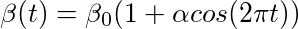

Where β 0 is the mean transmission rate and α is the amplitude of seasonal variation. A seasonal variation transmission rate should lead to oscillations periods that are integers of the period of forcing

* Spatial Models

Another assumption that is made in the previous examples is that the populations are isolated, this means that the population modeled is the absolute total population of a system or that this does not have contact with any other population. However, this in real life is not true. A way to face this issue is by using spatial models and by introducing the concept of metapopulation. This is a set of m = 1, ..., M populatons of size N n . The total number of individuals of the metapopulation is 

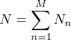

The  main  idea  of  spatial  models  is  that  there  is  an  interaction  between  the individuals of each different population and this can be seen as a random exchange of individuals between populations.  The set of equations that model these kind of systems are

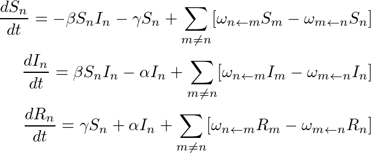

where Nn = Sn + In + Rn  is the size of the population *n* and *Wm<-n* is the probability per unit time that a person picked at random in population *n* travels to population *m*.

* Agent basde model (Cellular Automata CA)

The Cellular Automata (CA) used is based on the Kermack-McKendrick model. Each cell has a probability of becoming infected given by:

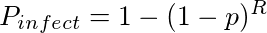
    
where $p$ is the probability that an infected cell will transmit the disease to a healthy cell and *R* is the number of cells surrounding a healthy cell using a *Moore Neighborhood* as the one depicted in figure bellow. The probability  of becoming a recovered cell is given by a random number *q* between 0 and 1. At each time step, a number equal to the total number of cells is selected ant the new state for each cell selected is computed according to the rules stated above. 

## Results

### Cellular Automata 

In the case of this project, the CA was implemented just to see how equivalent could an stochastic model and a deterministic one be. The CA model was tuned with to have a similar behavior as the one given by equations 2.7 with values of β = 0.6 and γ = 0.2. This was done by tuning the values of p and q stated in the equation 3.6. The CA model consisted in a grid of 150x150 cells with initial populations of 2400 susceptible cells and 100 infected. The model was run for 30 time steps.In the case of this project, it was just intended to see how equivalent could an stochastic model and a deterministic one be. The CA model was tuned with to have a similar behavior as the one given by equations 2.7 with values of β = 0.6 and γ = 0.2. This was done by tuning the
values of p and q stated in the equation 3.6. The CA model consisted in a grid of 150x150 cells with initial populations of 2400 susceptible cells and 100 infected. The model shown in the figure was run for 30 time steps.

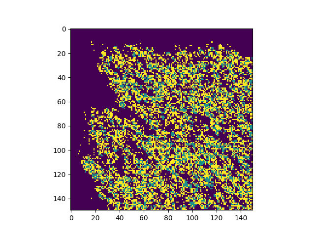

Snapshot of the simulation. Dark blue cells represent susceptible ones, blue are infected and yellow recovered one. 

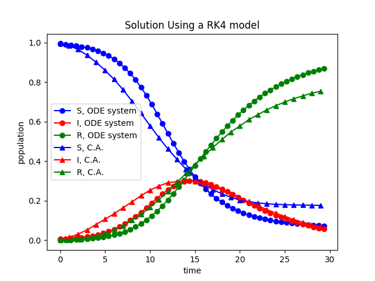

p = 0.65, q = 0.15

An advantage of the CA model is that it could be simply changed without the need of finding a numerical integration method for which the results converge. In this case a probability k was added to the algorithm so a recovered cell could convert into a susceptible one. The results are shown inthe next figures. 

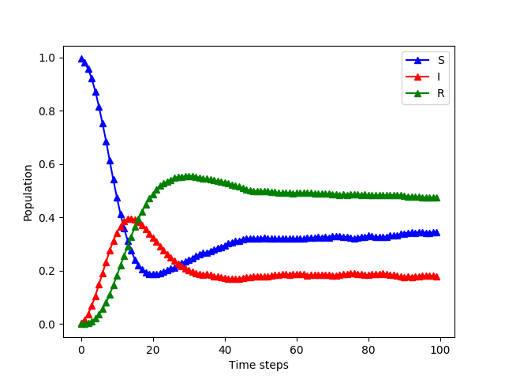

p = 0.72, q = 0.13, k = 0.05

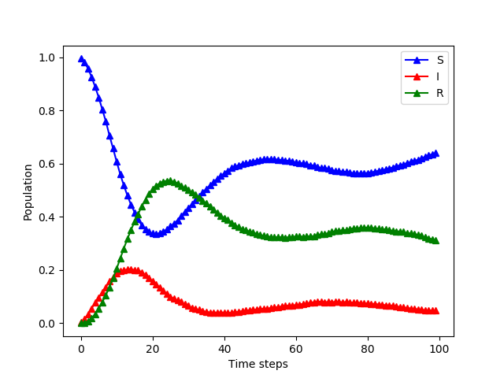

p = 0.72, q = 0.25, k = 0.05
